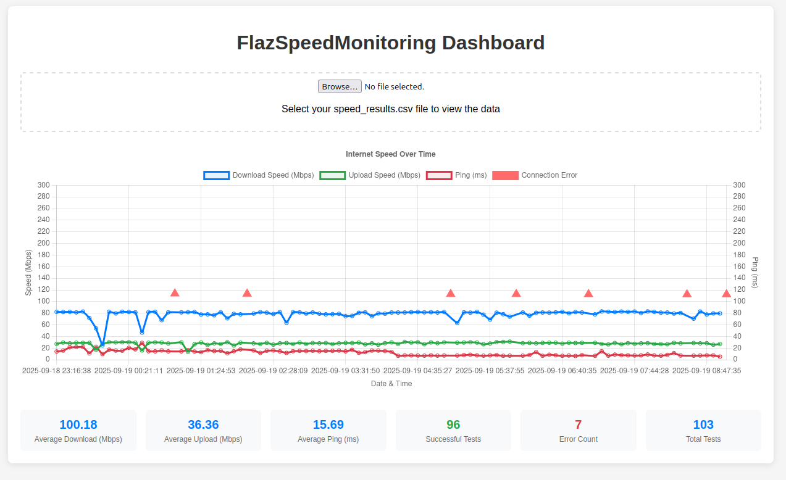

# FlazSpeedMonitoring

Aplikasi bash untuk monitoring kecepatan internet upload dan download secara berkala dengan interval yang dapat dikonfigurasi.

## Copyright & License

**Copyright © 2024 Mulyawan Sentosa - FlazHost.Com**

Program ini dilisensikan di bawah **GNU General Public License v3.0 (GPL-3.0)**

- ✅ **Gratis digunakan** untuk keperluan pribadi dan komersial
- ✅ **Boleh dimodifikasi** dan didistribusikan ulang
- ✅ **Kode sumber terbuka** dan harus tetap terbuka
- ⚠️ **Tanpa garansi** - gunakan dengan risiko sendiri

Lihat [LICENSE](https://www.gnu.org/licenses/gpl-3.0.html) untuk detail lengkap.

## Persyaratan

Script ini memerlukan `speedtest-cli` untuk berfungsi. Instalasi berbeda tergantung sistem operasi:

### 🐧 Linux (Ubuntu/Debian/CentOS/RHEL)

**Ubuntu/Debian:**
```bash
sudo apt update
sudo apt install speedtest-cli
```

**CentOS/RHEL/Fedora:**
```bash
# RHEL/CentOS dengan EPEL
sudo yum install epel-release
sudo yum install python3-pip
pip3 install speedtest-cli

# Fedora
sudo dnf install python3-pip
pip3 install speedtest-cli
```

**Arch Linux:**
```bash
sudo pacman -S speedtest-cli
```

### 🍎 macOS

**Menggunakan Homebrew (recommended):**
```bash
# Install Homebrew jika belum ada
/bin/bash -c "$(curl -fsSL https://raw.githubusercontent.com/Homebrew/install/HEAD/install.sh)"

# Install speedtest-cli
brew install speedtest-cli
```

**Menggunakan pip:**
```bash
pip3 install speedtest-cli
```

### 🪟 Windows

**Opsi 1: Menggunakan pip (Python required):**
```cmd
# Pastikan Python sudah terinstall
pip install speedtest-cli
```

**Opsi 2: Menggunakan Windows Subsystem for Linux (WSL):**
```bash
# Install WSL Ubuntu terlebih dahulu
wsl --install

# Setelah restart, buka WSL dan install speedtest-cli
sudo apt update
sudo apt install speedtest-cli
```

**Opsi 3: Menggunakan Chocolatey:**
```cmd
# Install Chocolatey terlebih dahulu
# Kemudian install speedtest-cli
choco install speedtest
```

### 📦 Universal (All OS):
```bash
pip install speedtest-cli
```

### 📦 Menggunakan snap (Linux):
```bash
sudo snap install speedtest-cli
```

## Cara Penggunaan

### 🐧 Linux / 🍎 macOS

1. **Beri permission executable:**
```bash
chmod +x flazspeedmonitor.sh
```

2. **Jalankan script:**
```bash
./flazspeedmonitor.sh
```

### 🪟 Windows

**Opsi 1: Menggunakan WSL (Recommended):**
```bash
# Di WSL Terminal
chmod +x flazspeedmonitor.sh
./flazspeedmonitor.sh
```

**Opsi 2: Menggunakan Git Bash:**
```bash
# Di Git Bash Terminal
chmod +x flazspeedmonitor.sh
./flazspeedmonitor.sh
```

**Opsi 3: Menggunakan PowerShell/CMD dengan Bash:**
```cmd
# Jika menggunakan Windows dengan bash support
bash flazspeedmonitor.sh
```

2. Pilih interval speedtest:
   - **1 menit, 2 menit, 5 menit, 10 menit, 15 menit, 30 menit**
   - **Custom interval** (input manual dalam menit)

3. Pilih durasi monitoring:
   - **Opsi 1**: Masukkan waktu akhir (format HH:MM, 24-jam)
   - **Opsi 2**: Masukkan durasi dalam jam
   - **Opsi 3**: Jalankan terus-menerus (hentikan dengan Ctrl+C)

4. Script akan:
   - Melakukan speed test sesuai interval yang dipilih
   - Menyimpan hasil ke file `speed_results.csv`
   - Menampilkan progress secara real-time

## Format Output CSV

File `speed_results.csv` berisi kolom-kolom berikut:
- `Timestamp`: Unix timestamp
- `Date`: Tanggal (YYYY-MM-DD)
- `Time`: Waktu (HH:MM:SS)
- `Download_Speed_Mbps`: Kecepatan download dalam Mbps
- `Upload_Speed_Mbps`: Kecepatan upload dalam Mbps
- `Ping_ms`: Latency dalam milliseconds
- `Server_Location`: Lokasi server test
- `ISP`: Internet Service Provider

## Contoh Penggunaan

```bash
# Jalankan script
./flazspeedmonitor.sh

# Pilih interval (misalnya 2 menit)
Select interval option (1-7): 2

# Pilih durasi (misalnya 2 jam)
Select option (1/2/3): 2
Enter duration in hours: 2

# Script akan berjalan selama 2 jam dengan interval 2 menit
```

## Fitur

- ✅ **Interval fleksibel** - 1, 2, 5, 10, 15, 30 menit atau custom
- ✅ Input fleksibel untuk durasi monitoring
- ✅ Penyimpanan hasil dalam format CSV
- ✅ Penanganan error jika test gagal
- ✅ Summary hasil real-time
- ✅ Graceful exit dengan Ctrl+C
- ✅ Validasi format input

## Visualisasi Data

File `index.html` disediakan untuk memvisualisasikan data hasil monitoring dalam bentuk grafik interaktif.

### Contoh Tampilan Dashboard



*Screenshot menunjukkan dashboard dengan grafik real-time dan statistik monitoring kecepatan internet*

### Cara Menggunakan Dashboard:

1. **Buka dashboard**:

   **🐧 Linux:**
   ```bash
   # Firefox
   firefox index.html

   # Chrome/Chromium
   google-chrome index.html
   chromium-browser index.html

   # Default browser
   xdg-open index.html
   ```

   **🍎 macOS:**
   ```bash
   # Default browser
   open index.html

   # Safari
   open -a Safari index.html

   # Chrome
   open -a "Google Chrome" index.html
   ```

   **🪟 Windows:**
   ```cmd
   REM Default browser
   start index.html

   REM Chrome
   start chrome index.html

   REM Edge
   start msedge index.html
   ```

   **WSL (Windows Subsystem for Linux):**
   ```bash
   # Buka dengan default browser Windows
   explorer.exe index.html
   ```

2. **Auto-load data**: Dashboard akan secara otomatis memuat file `speed_results.csv` jika berada di direktori yang sama

3. **Manual upload**: Jika file CSV tidak ditemukan, Anda dapat mengupload file CSV secara manual menggunakan file input

### Fitur Dashboard:

- ✅ **Grafik garis interaktif** dengan Chart.js
- ✅ **Multi-axis chart**: Speed (Mbps) di kiri, Ping (ms) di kanan
- ✅ **Real-time statistics**: Rata-rata download, upload, ping
- ✅ **Test counter**: Successful tests, error count, dan total tests
- ✅ **Error markers**: Penanda segitiga merah untuk connection errors
- ✅ **Responsive design** yang mobile-friendly
- ✅ **Auto-loading** CSV dari direktori yang sama
- ✅ **Manual file upload** jika diperlukan

### Komponen Visualisasi:

- **Line Chart**: Menampilkan trend download speed, upload speed, dan ping over time
- **Error Markers**: Segitiga merah menunjukkan waktu terjadinya connection error
- **Statistics Cards**:
  - Average Download/Upload/Ping (hanya dari test yang sukses)
  - Successful Tests (hijau) - jumlah test berhasil
  - Error Count (merah) - jumlah test gagal
  - Total Tests - total semua test
- **Dual Y-Axis**: Speed dalam Mbps (kiri) dan Ping dalam ms (kanan)
- **Time Labels**: Menampilkan tanggal dan waktu untuk setiap data point

## 💡 Tips OS-Specific

### 🐧 Linux
- Pastikan user memiliki permission untuk menjalankan script
- Gunakan `nohup` untuk menjalankan di background: `nohup ./flazspeedmonitor.sh &`
- File log tersimpan di direktori yang sama dengan script

### 🍎 macOS
- Mungkin perlu bypass Gatekeeper untuk file script: `sudo spctl --master-disable` (tidak recommended untuk security)
- Atau klik kanan script → Open → Open untuk bypass sekali
- Terminal default sudah support bash script

### 🪟 Windows
- **WSL (Recommended)**: Performa terbaik dan kompatibilitas penuh
- **Git Bash**: Alternative yang baik jika WSL tidak tersedia
- **PowerShell**: Mungkin memerlukan konfigurasi tambahan untuk bash support
- File CSV akan tersimpan di direktori script di dalam WSL/Git Bash environment

## 🔧 Troubleshooting

### Error "speedtest-cli not found"
```bash
# Cek apakah speedtest-cli terinstall
which speedtest-cli

# Jika tidak ada, install ulang sesuai OS
```

### Error "Permission denied"
```bash
# Linux/macOS/WSL
chmod +x flazspeedmonitor.sh

# Windows dengan Git Bash
chmod +x flazspeedmonitor.sh
```

### Dashboard tidak bisa load CSV
- Pastikan file `index.html` dan `speed_results.csv` di direktori yang sama
- Coba refresh browser (F5)
- Cek console browser untuk error details

## Tips Umum

- Pastikan koneksi internet stabil saat menjalankan
- File CSV akan dibuat otomatis di direktori yang sama
- Gunakan Ctrl+C untuk menghentikan monitoring kapan saja
- Hasil test yang gagal akan ditandai sebagai "ERROR" dalam CSV
- Gunakan dashboard HTML untuk analisis visual yang lebih mudah
